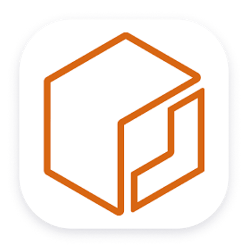
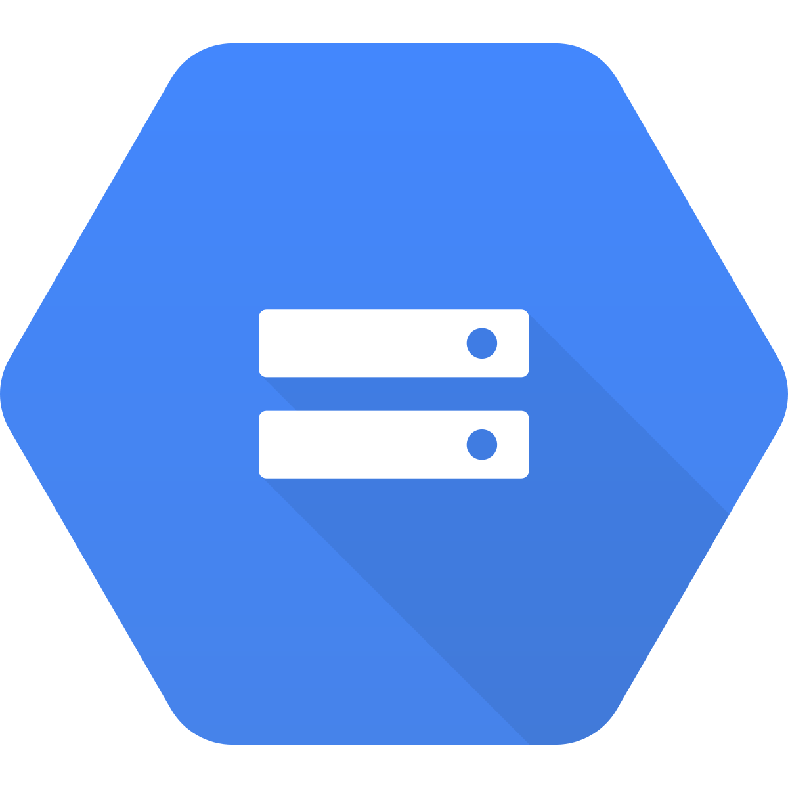
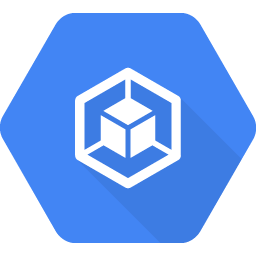

<div align="center">

<!-- ANIMATED BANNER -->


<!-- TYPING HEADER -->
<a href="#">
  
</a>

<br/>

<p>
  
  &nbsp;
  
  &nbsp;
  
</p>

</div>

---

```bash
$ whoami
╔══════════════════════════════════════════════════════════════╗
║         DevOps & Cloud Engineer ║ System Administrator       ║
╚══════════════════════════════════════════════════════════════╝

  🌏  Location    : East Java, Indonesia
  🧠  Experience  : 1 Year Work Experience 
  💼  Speciality  : Cloud-Native, DevOps, Microservices, CI/CD, Observability
  🎯  Focus       : Scalability · Security · Performance · Reusability 
  ✉️  Contact     : mochamadabdulrouf1@gmail.com

$ cat passion.txt
  "I don't just write code — I architect systems that survive at scale"
```

---

<br/>

## 🛠️ Languages & Tools I Use

<br/>

### 🎨 Programming Knowledge

<table>
  <tr>
    <td align="center" width="96">
      
      <br /><sub><b>Next.js</b></sub>
    </td>
    <td align="center" width="96">
      
      <br /><sub><b>React</b></sub>
    </td>
    <td align="center" width="96">
      
      <br /><sub><b>TypeScript</b></sub>
    </td>
    <td align="center" width="96">
      
      <br /><sub><b>JavaScript</b></sub>
    </td>
    <td align="center" width="96">
      
      <br /><sub><b>Node.js</b></sub>
       <td align="center" width="96">
      
      <br /><sub><b>YAML</b></sub>
    </td>
    <!-- <td align="center" width="96">
      
      <br /><sub><b>Go</b></sub>
    </td> -->
    <!-- <td align="center" width="96">
      
      <br /><sub><b>Python</b></sub>
    </td> -->
  </tr>
</table>

<br/>

### 🗄️ Database & Storage

<table>
  <tr>
    <td align="center" width="96">
      
      <br /><sub><b>MongoDB</b></sub>
    </td>
    <td align="center" width="96">
      
      <br /><sub><b>PostgreSQL</b></sub>
    </td>
    <td align="center" width="96">
      
      <br /><sub><b>Redis</b></sub>
    </td>
    <td align="center" width="96">
      
      <br /><sub><b>DynamoDB</b></sub>
    </td>
    <td align="center" width="96">
      
      <br /><sub><b>Amazon S3</b></sub>
    </td>
    <td align="center" width="96">
      
      <br /><sub><b>Amazon RDS</b></sub>
    </td>
        <td align="center" width="96">
      
      <br /><sub><b>MySQL</b></sub>
    </td>
  </tr>
</table>

<br/>

### ☁️ Cloud — AWS

<table>
  <tr>
    <td align="center" width="96">
      
      <br /><sub><b>AWS</b></sub>
    </td>
    <td align="center" width="96">
      
      <br /><sub><b>EC2</b></sub>
    </td>
    <td align="center" width="96">
      
      <br /><sub><b>EKS</b></sub>
    </td>
    <td align="center" width="96">
      
      <br /><sub><b>ECS</b></sub>
    </td>
    <td align="center" width="96">
      
      <br /><sub><b>ECR</b></sub>
    </td>
    <td align="center" width="96">
      
      <br /><sub><b>VPC</b></sub>
    </td>
  </tr>
</table>

<br/>

### ☁️ Cloud — GCP

<table>
  <tr>
    <td align="center" width="96">
      
      <br /><sub><b>GCP</b></sub>
    </td>
    <td align="center" width="96">
      
      <br /><sub><b>Compute</b></sub>
    </td>
    <td align="center" width="96">
      
      <br /><sub><b>Network</b></sub>
    </td>
    <td align="center" width="96">
      
      <br /><sub><b>GCS</b></sub>
    </td>
    <td align="center" width="96">
      
      <br /><sub><b>GKE</b></sub>
    </td>
    <td align="center" width="96">
      
      <br /><sub><b>Artifact Reg.</b></sub>
    </td>
  </tr>
</table>

<br/>

### 🐳 Containers & Orchestration

<table>
  <tr>
    <td align="center" width="96">
      
      <br /><sub><b>Docker</b></sub>
    </td>
    <td align="center" width="96">
      
      <br /><sub><b>Kubernetes</b></sub>
    </td>
    <td align="center" width="100">
      
      <br /><sub><b>k3s</b></sub>
    </td>
    <td align="center" width="96">
      
      <br /><sub><b>Helm Chart</b></sub>
    </td>
    <td align="center" width="100">
      
      <br /><sub><b>ArgoCD</b></sub>
    </td>
  </tr>
</table>

<br/>

### 🔧 DevOps, IaC & Version Control

<table>
  <tr>
    <td align="center" width="96">
      
      <br /><sub><b>Terraform</b></sub>
    </td>
    <td align="center" width="96">
      
      <br /><sub><b>Ansible</b></sub>
    </td>
    <td align="center" width="96">
      
      <br /><sub><b>Jenkins</b></sub>
    </td>
    <td align="center" width="96">
      
      <br /><sub><b>Git</b></sub>
    </td>
    <td align="center" width="96">
      
      <br /><sub><b>Pritunl</b></sub>
    </td>
    <td align="center" width="96">
      
      <br /><sub><b>Linux</b></sub>
    </td>
    <td align="center" width="96">
      
      <br /><sub><b>Nginx</b></sub>
    </td>
    <td align="center" width="96">
      
      <br /><sub><b>Apache</b></sub>
    </td>
      <td align="center" width="96">
      
      <br /><sub><b>Bash Script</b></sub>
    </td>
  </tr>
</table>

<br/>

### 📊 CI/CD
<table>
  <tr>
    <td align="center" width="96">
      
      <br /><sub><b>Jenkins</b></sub>
    </td>
    <td align="center" width="96">
      
      <br /><sub><b>Github Actions</b></sub>
    </td>
  </tr>
</table>

### 📊 Monitoring, Quality & Observability

<table>
  <tr>
    <td align="center" width="96">
      
      <br /><sub><b>Prometheus</b></sub>
    </td>
    <td align="center" width="96">
      
      <br /><sub><b>Grafana</b></sub>
    </td>
    <td align="center" width="96">
      
      <br /><sub><b>SonarQube</b></sub>
    </td>
  </tr>
</table>

---

<br/>

<br/>

<div align="center">

## 📊 GitHub Stats


</br>


<br/>


</div>

---

<br/>

<!-- <div align="center">

## 🌿 Contribution Activity


</div>

---

<br/>

<div align="center"> -->

<!-- ## 🚀 Featured Projects

[](https://github.com/YOUR_USERNAME/YOUR_REPO_1)
&nbsp;
[](https://github.com/YOUR_USERNAME/YOUR_REPO_2)

</div>

--- -->

<br/>

<div align="center">

<!-- ## 💬 Engineering Principles

</div>


### 💻🧐Enjoy Learning About This 
<p align="left">


</p>

<br/>

<!-- <picture>
  <source media="(prefers-color-scheme: dark)" srcset="https://raw.githubusercontent.com/MochamadAbdulRouf/MochamadAbdulRouf/output/github-contribution-grid-snake-dark.svg" />
  <source media="(prefers-color-scheme: light)" srcset="https://raw.githubusercontent.com/MochamadAbdulRouf/MochamadAbdulRouf/output/github-contribution-grid-snake.svg" />
  
</picture> -->

</div>


<div align="center">
  <sub> I can and I will, watch Me </sub>
</div>
